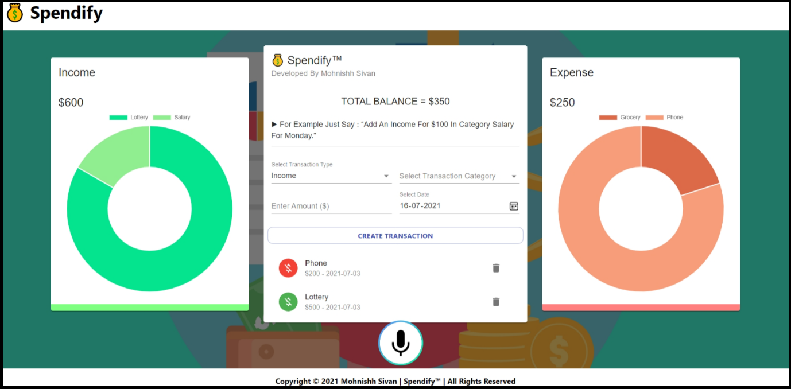

<h2>💰 Spendify™ – Expense Management Application</h2>

 

Designed and Developed a Voice Activated Expense Management Application called Spendify using HTML 5, CSS 3, React JavaScript, Speechly Software and Document Object Model Storage.

<h4>KEY FEATURES :-</h4>
 ● &nbsp; 
 ● &nbsp; 
 ● &nbsp; 
 ● &nbsp; 

<h4>APPLICATION URL :-</h4>
💰 Spendify™ - https://spendifyapplication.netlify.app/

<h4>LICENSE AGREEMENT :-</h4>
Released Under MIT License. 

Permission Is Hereby Granted, Free Of Charge, To Any Person Obtaining A Copy Of This Software And Associated Documentation Files (The "Software"), To Deal In The Software Without Restriction, Including Without Limitation The Rights To Use, Copy, Modify, Merge, Publish, Distribute, Sublicense, And/Or Sell Copies Of The Software, And To Permit Persons To Whom The Software Is Furnished To Do So, Subject To The Following Conditions :- 

1.&nbsp;The Below Copyright Notice And This Permission Notice Shall Be Included In All Copies Or Substantial Portions Of The Software.

2.&nbsp;The Software Is Provided "As Is", Without Warranty Of Any Kind, Express Or Implied, Including But Not Limited To The Warranties Of Merchantability, Fitness For A Particular Purpose And Noninfringement. In No Event Shall The Original Author Or Copyright Holder Be Liable For Any Claim, Damages Or Other Liability, Whether In An Action Of Contract, Tort Or Otherwise, Arising From, Out Of Or In Connection With The Software Or The Use Or Other Dealings In The Software. 

<h4 align="center">Copyright © 2021 Mohnishh Sivan | Spendify™ | All Rights Reserved</h4>
